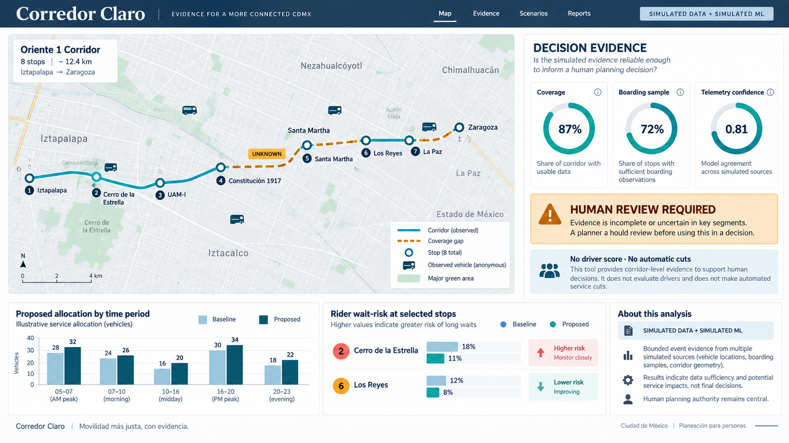
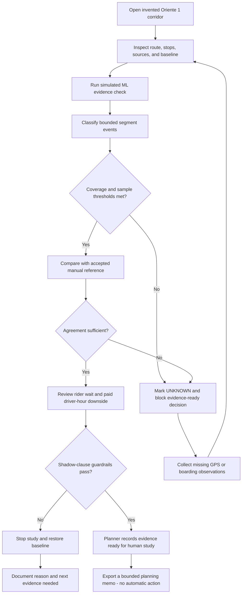
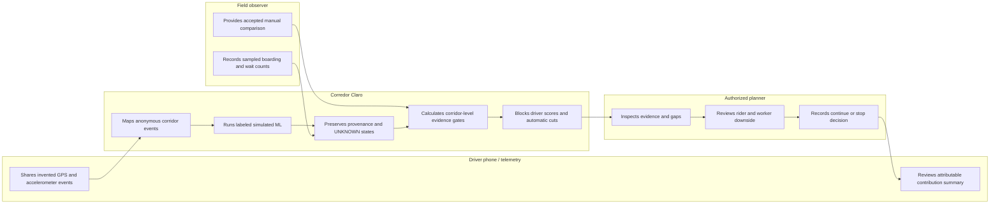

# Corredor Claro - Week 7 build packet

## Problem in my words

Mexico City does not need another ride-hailing interface or a dashboard that turns imperfect GPS traces into permanent judgments about drivers. A corridor planner needs to know whether existing, low-cost evidence is complete and representative enough to support one bounded service-allocation study. Corredor Claro makes the gaps visible before a planner claims savings, reduces vehicles, or shifts the cost of a decision to riders and workers.

## Exact user

Lucia is an invented SEMOVI corridor-planning analyst assigned to a funded pilot for one colectivo corridor. She has authority to prepare an evidence memo but not to sanction drivers or change service automatically. She needs to compare simulated phone/GPS telemetry, accelerometer events, sampled boarding counts, and a manual reference; understand where evidence is missing; inspect the effect on high-dependence stops and paid driver hours; and record a human decision to continue the study or stop it.

## Success definition

Before the module closes, Lucia can open one invented corridor, inspect its route and stops on a map, run a clearly labeled simulated-ML evidence check, review segment-level provenance and UNKNOWN states, compare the result with a manual reference, see rider and worker downside checks, and record either **Evidence ready for human study** or **Stop and collect more evidence** without producing a driver score, automatic service cut, or unverified ROI claim.

## Image-generated mockup

This image was generated before implementation as a design target. The working product may simplify the visual treatment to improve accessibility, responsiveness, and honest representation of the data.

## Feature flow

## Actor swimlane

## Benchmark

Best existing solution on Earth: [Swiftly's Transit Data Platform](https://www.goswift.ly/transit-data-platform) is the strongest benchmark because it turns existing CAD/AVL and GPS data into mapped operations views, performance analysis, and AI-assisted correction of missing vehicle observations for more than 200 transit agencies.

Mine differs or localizes by: Corredor Claro is a smaller Mexico-first evidence gate for a single colectivo corridor that combines local route geography, sampled boardings, phone telemetry, explicit UNKNOWN states, an accepted manual comparison, and rider/worker safeguards before any planning or economic claim.

The data structure follows [GTFS Realtime vehicle-position concepts](https://developers.google.com/transit/gtfs-realtime) and uses the [CDMX open route and stop dataset](https://datos.cdmx.gob.mx/dataset/rutas-y-corredores-del-transporte-publico-concesionado) only as geographic context. Every operational record shown in the prototype is invented and labeled simulated.

## Long view - light charter

If this slice works, in three years Corredor Claro becomes a trusted evidence-to-intervention layer for operators and authorities evaluating service changes across multiple Mexican cities. It combines consented vehicle telemetry, representative rider observations, open route data, and auditable human decisions without creating permanent driver identity scores. Its value is measured by decisions that become faster and better supported while preserving service for dependent riders, paid transition paths for workers, and the right to challenge incomplete evidence.

## Scope cut

This week I am **not** building:

- a ride-hailing, passenger-matching, fare, or dispatch app;
- a citywide network optimizer or a live SEMOVI integration;
- an autonomous-vehicle controller or safety certification system;
- real tracking of drivers, passengers, devices, or license plates;
- a permanent driver score, ranking, sanction, or identity profile;
- an automatic route change, vehicle cut, worker displacement, or enforcement action;
- a claim of verified financial savings or 10:1 return;
- production authentication, a user database, or storage of personal data;
- a real machine-learning model trained on field data.

The prototype uses invented corridor, vehicle, event, and boarding records. Its deterministic classifier is a **simulated ML model** and is labeled that way wherever results appear.

## Architecture and stack

| Layer | Choice | Why it is enough this week |
|---|---|---|
| Interface | React + TypeScript + Vite | Fast, accessible single-page prototype with bounded state |
| Geodata/maps | Leaflet + OpenStreetMap tiles; invented corridor GeoJSON | Real map interaction and route geometry without proprietary keys |
| Sensors/phone telemetry | Invented GPS pings plus accelerometer jerk events | Demonstrates a low-cost third Dragon Stack layer without collecting real people |
| ML | Deterministic simulated-ML segment classifier | Exposes inputs, confidence, UNKNOWN output, and reproducible results without overstating capability |
| Manual evidence | Invented field boarding counts and wait observations | Tests digital estimates against a separate accepted reference |
| Decision logic | Pure TypeScript gate functions | Keeps thresholds, provenance, rider risk, and worker safeguards auditable and testable |
| Persistence | Session-only browser state | Stores no personal data, so authentication and Row Level Security are not applicable |
| Hosting | Vercel static deployment | Free public URL with no server or secret required |
| Documentation | Markdown, Mermaid, generated PDFs | Preserves packet-before-code, test, persona, and decision evidence |

## Evidence gates

The slice starts with transparent proposed thresholds, not claims of policy:

1. At least 85% usable GPS coverage across the corridor.
2. At least 70% of stops represented by supervised boarding samples.
3. At least 80% agreement between the simulated-ML classification and the manual reference.
4. Every low-confidence segment remains UNKNOWN rather than being forced into a result.
5. No tested scenario may increase the observed 90th-percentile wait by more than five minutes at a sampled high-dependence stop.
6. No tested scenario may reduce paid driver hours without an equivalent transition role or compensation plan.
7. Only an authorized planner may record an evidence status, and that status does not implement a service change.

## Security floor decisions

1. No API key or secret is required. The map uses public OpenStreetMap tiles and the app has no privileged backend.
2. The prototype stores no personal data and uses only invented, explicitly labeled records; authentication is therefore out of scope.
3. No database or user table exists, so Row Level Security is not applicable.
4. The planner note is trimmed, length-limited, and validated before it enters session state.
5. Seed records contain no real names, device identifiers, license plates, or precise traces belonging to real people.

## Test plan

### Mechanical pass

1. The map loads one corridor, eight stops, anonymous vehicles, coverage gaps, and a clear simulated-data label.
2. The simulated-ML check classifies only segment events and exposes its inputs and confidence.
3. A low-confidence or missing-data segment appears as UNKNOWN rather than safe or unsafe.
4. The evidence-ready decision remains blocked if GPS coverage, boarding coverage, manual agreement, rider wait, or worker transition gates fail.
5. Changing the test scenario updates wait-risk and paid-hours checks without changing the baseline record.
6. The page contains no driver score, star rating, ranking, sanction control, or automatic cut action.
7. The planner can record a bounded continue/stop decision only after writing a note of 12-280 characters.
8. Invalid notes display an accessible error and do not enter state.
9. The decision log shows that a human made the decision and that no operational action occurred.
10. The interface works with keyboard controls and remains readable at 390px and 1440px widths.

### Persona pass

Use a fresh synthetic-user conversation as **Lucia**, an invented 38-year-old corridor-planning analyst who is experienced with spreadsheets and field surveys but skeptical of black-box models. She is under time pressure, needs to defend the study to her director and to driver representatives, and will abandon the tool if she cannot tell what is simulated, why a gate failed, or whether a button changes real service. Walk her through screenshots in task order, record every hesitation, and fix the most consequential confusion before the final deployment.

## Acceptance boundary

The slice succeeds when it helps a human determine whether the evidence is ready for a planning study. It does not prove that SEMOVI will buy the study, that the evidence is representative in the real world, that a route should change, or that any financial return exists.

## Post-persona clarification

The working prototype tightened this boundary after the synthetic-user test. Because the coverage-first values are hypothetical and simulated, a passing state is labeled **scenario candidate for human study**, not evidence collected or accepted in the field. A provenance panel now exposes every change from baseline, its simulated version/date, and the fact that no real observations were added.
