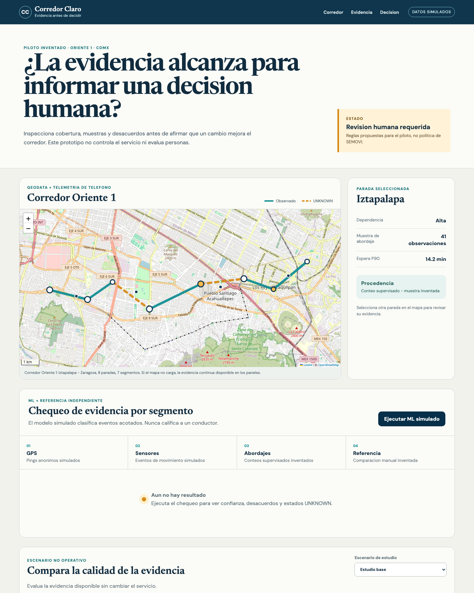
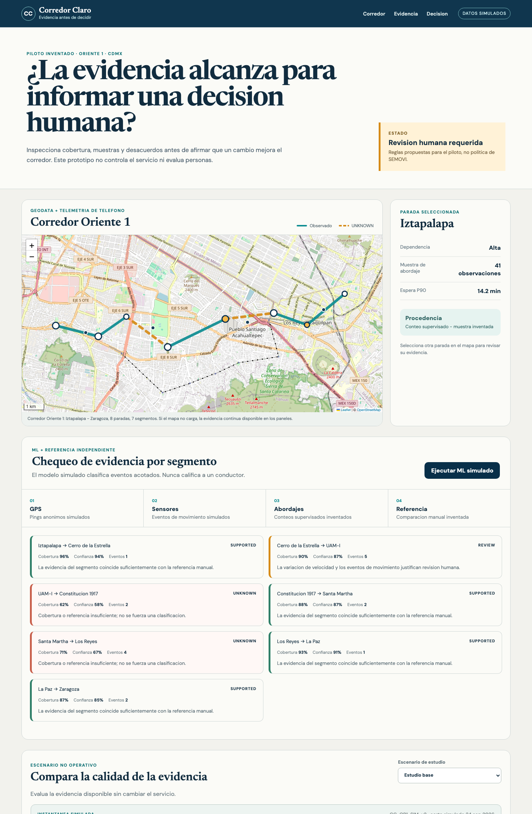
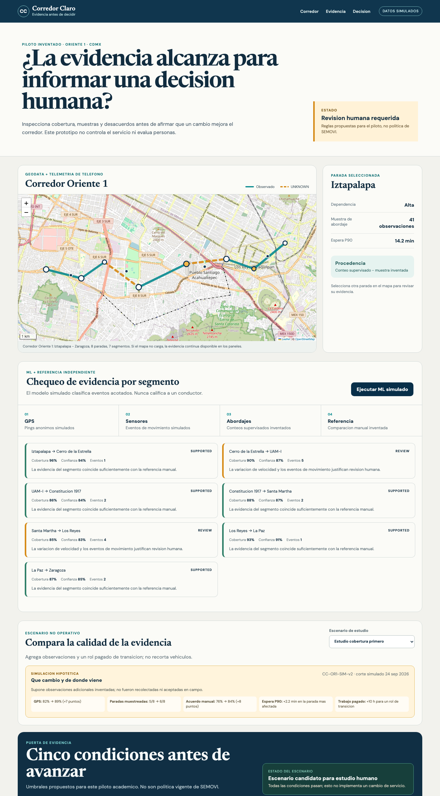

# Corredor Claro - persona test

## Test setup

- **Date:** 24 September 2026
- **Method:** Fresh synthetic-user task inside the Week 7 build chat
- **Persona:** Lucia, an invented 38-year-old SEMOVI corridor-planning analyst
- **Context:** Lucia uses spreadsheets and field surveys, distrusts black-box models, is under time pressure, and must defend a study to both her director and driver representatives.
- **Task:** Determine whether the evidence is ready for a human planning study, not authorize a service change.

All people, vehicles, corridor events, counts, and model outputs shown in this test are invented and labeled simulated.

<!-- pagebreak -->

## Screen 1 - initial state

Lucia's first move was clear: run the simulated-ML check. She immediately understood that the product was not controlling service or evaluating drivers.

### Hesitations

- The five corridor gates already displayed `PASA/FALTA` before the model ran, while the main status said the review was incomplete. She was unsure whether the gates were preliminary inputs or final conclusions.
- `UNKNOWN` appeared in English inside an otherwise Spanish interface.
- `Espera P90`, `confianza`, and `acuerdo manual` were not defined for a non-technical audience.
- The prominent map did not state whether every stop had to be inspected before recording a posture.

<!-- pagebreak -->

## Screen 2 - baseline simulated-ML result

Lucia correctly concluded that the baseline was not ready: two segments remained UNKNOWN and three corridor gates failed.

### Hesitations and trust concerns

- She initially read `REVIEW` as failure because the difference among `SUPPORTED`, `REVIEW`, and `UNKNOWN` was not summarized.
- `Eventos` did not tell her whether the signal represented braking, acceleration, speed variance, or phone movement.
- The screen lacked a sample period, comparison count, dataset version, and direct calculation trail.
- She had to mentally reconcile seven segment states with five corridor gates.
- Under time pressure, she might stop here and forward a screenshot because the conclusion was visible but its defensible reason required too much scanning.

## Screen 3 - coverage-first passing state

Lucia saw all five conditions pass and no UNKNOWN segments. She understood that the correct action was to record a posture for further study, not approve a route or service change.

### Most consequential confusion

Selecting `Estudio cobertura primero` appeared to improve the evidence instantly. Lucia could not tell whether the better values represented collected observations or a hypothetical scenario. The dropdown risked making it look as if an analyst could choose the scenario that makes the gates pass.

Her recommendation was a persistent **Que cambio y de donde viene** panel that lists each change from baseline, its version/date, and a clear `Simulacion hipotetica` or `Evidencia observada` status. For hypothetical evidence, the final action should record a candidate scenario rather than claim that evidence is ready.

## Fix implemented

The product now:

- labels the coverage-first state **SIMULACION HIPOTETICA**;
- states that its added observations were invented and were not collected or accepted in the field;
- shows dataset version `CC-OR1-SIM-v2` and a simulated date;
- lists the exact changes from baseline for GPS coverage, sampled stops, manual agreement, P90 wait, and paid driver hours;
- changes the passing status to **Escenario candidato para estudio humano**;
- changes the enabled action to **Registrar escenario candidato**.

## Retest result

Lucia can now explain why the numbers changed without mistaking the scenario for collected evidence. The screen preserves the useful comparison while making its epistemic status explicit. Recording the candidate creates only a local trace entry and repeats that no operational action occurred.

## Remaining improvements after the deadline

1. Add short Spanish definitions for P90, model confidence, manual agreement, and the three segment states.
2. Add a compact blocked-reasons summary linking segment gaps to corridor gates.
3. Replace invented timestamps and version labels only after a real authority accepts a sampling protocol.
